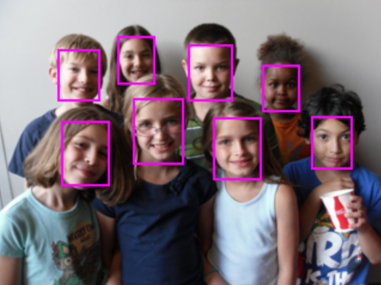

# Ultra-Fast-Face-Detector-1MB

## Features
- 基于TNN推理框架
- RetinaFace人脸检测模型
- 模型预测包括以下三部分：人脸位置，confidence，人脸5个关键点

## Prediction Example

## Todo
- 加入MNN支持
- 加入pth -> onnx转换脚本
- 加入onnx -> tnn模型转换方法

## References
- [Face-Detector-1MB-with-landmark](https://github.com/biubug6/Face-Detector-1MB-with-landmark)
- [Ultra-Light-Fast-Generic-Face-Detector-1MB](https://github.com/Linzaer/Ultra-Light-Fast-Generic-Face-Detector-1MB)